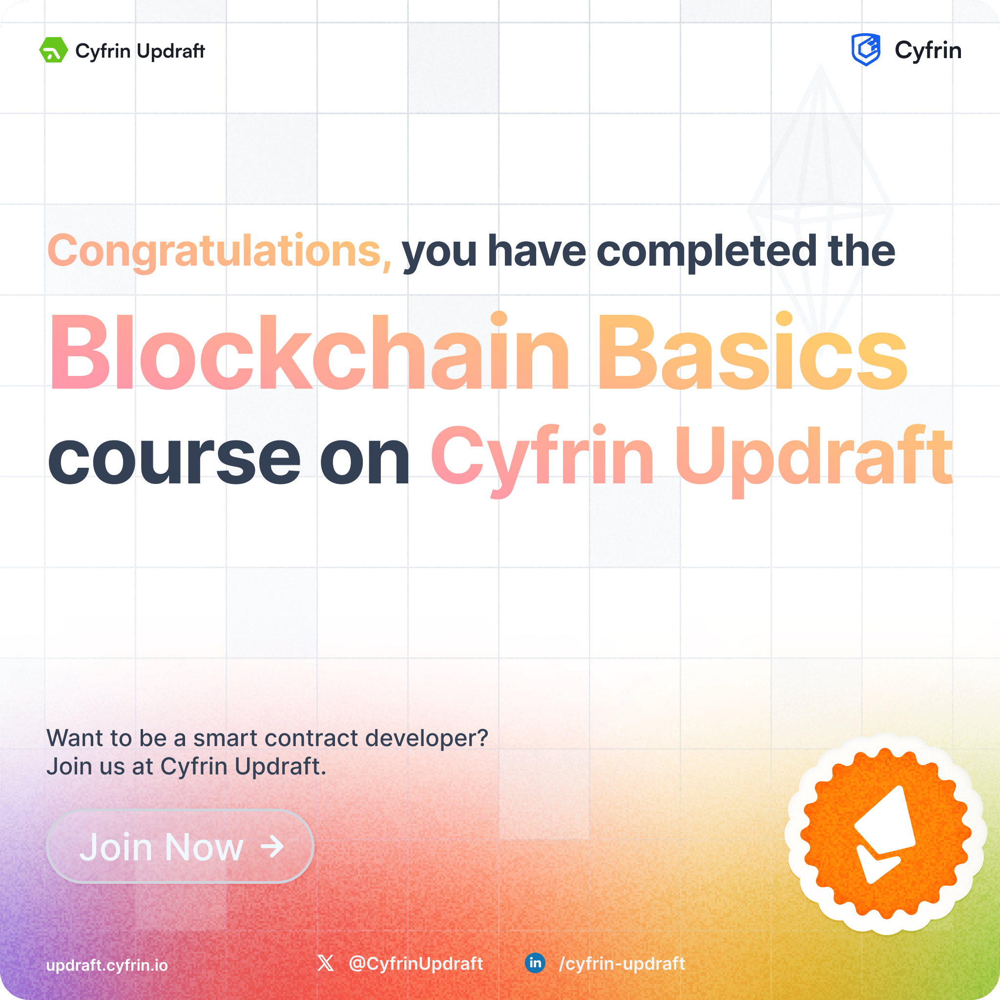

<h1 align="center"><code> 11BB </code></h1>
<h2 align="center"><i>Beginner BlockChain Basics</i></h2>

# What ? 

1. This will have any learning related work from the [Beginner- Blockchain Basics Course ](https://updraft.cyfrin.io/courses/blockchain-basics)

# SubDirs 

Dir | What
:--: | :--: 
[`nbs`](./nbs/) | Jupyter notebooks using various apps for learning and testing concepts in python code

# Working Repository 

1. The course requires the usage of [`remixide`](https://remix.ethereum.org/), While working you have linked it to the following repository which contains the actual work

https://github.com/xyizko/xo-ucy-SSCD-2 
- Working repository of code from remix 

# Completion Certificate 

